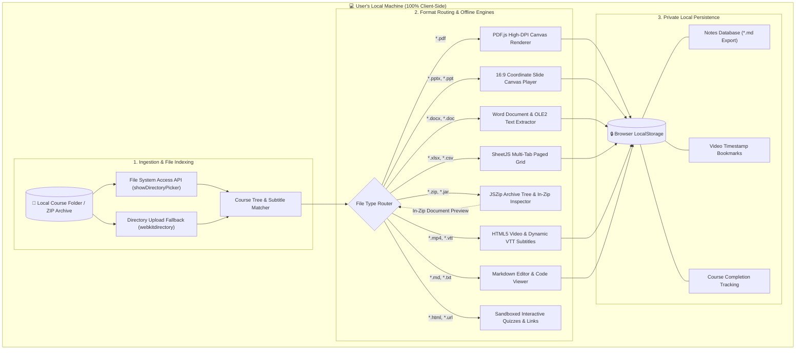
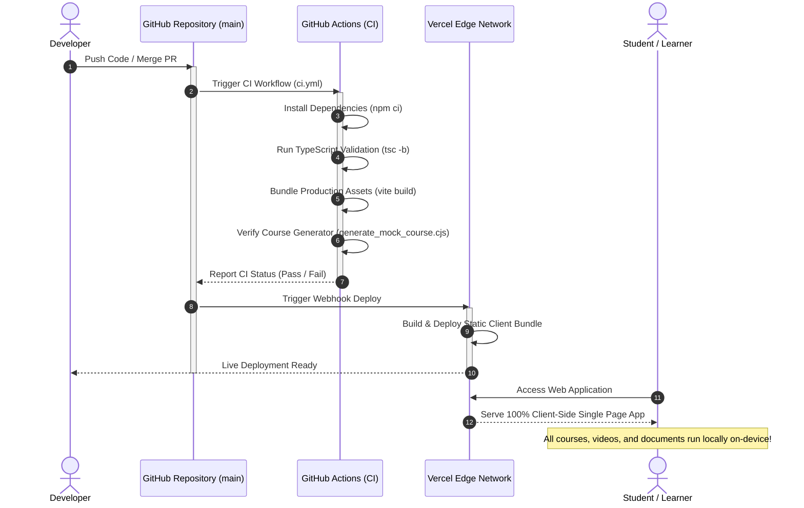

# 🪐 Akhil Orbit Player

[](https://akhil-orbit-player.vercel.app/)
[](https://github.com/Akhil-Binu/teachable/actions)
[](https://www.typescriptlang.org/)
[](https://react.dev/)
[](https://vite.dev/)
[](https://opensource.org/licenses/MIT)

**Akhil Orbit Player** is an ultra-fast, modern, 100% private client-side course player and document workstation designed to organize, play, and inspect educational courses and documents directly from local device folders or compressed archives.

All media rendering, document parsing, archive decompression, note taking, and progress tracking execute **entirely inside your browser**—**zero files are uploaded to any external server.**

🌐 **Live Web Application**: [https://akhil-orbit-player.vercel.app/](https://akhil-orbit-player.vercel.app/)

---

## 🔄 System Architecture & Application Workflow



---

## 🔄 CI / CD & Deployment Workflow



---

## 🌟 Supported Document & Media Formats

| Category | File Extensions | Capabilities & Features |
| :--- | :--- | :--- |
| **PDF Documents** | `.pdf` | High-DPI native canvas rendering via PDF.js. Single page & continuous scroll modes, zoom (50%–200%), page jumper, and 90° page rotation. |
| **PowerPoint Presentations** | `.pptx`, `.ppt`, `.ppsx`, `.odp` | 16:9 coordinate-based canvas layout with text runs, shapes, tables, embedded slide media, thumbnail outline strip, and full-screen **Present** mode. |
| **Word Documents** | `.docx`, `.doc`, `.dotx`, `.odt`, `.rtf` | High-fidelity rendering with heading styles, bullet points, font sizing, zoom controls, and **Light / Dark Paper** theme toggles. |
| **Excel & Spreadsheets** | `.xlsx`, `.xls`, `.csv`, `.tsv`, `.ods` | Multi-sheet tab workbook browser with sticky row numbers, column letters (`A`, `B`, `C`...), search filtering, 100-row pagination, and CSV export. |
| **Compressed Archives** | `.zip`, `.jar`, `.tar`, `.gz` | In-browser file tree browser, search, single-file extraction, and **embedded in-zip document viewing** without unzipping to disk! |
| **Video & Audio** | `.mp4`, `.webm`, `.ogg`, `.mp3`, `.wav` | HTML5 video/audio player with 0.5x–2.0x playback rates, dynamic `.vtt` caption matching, timestamp bookmarks, and auto-resume tracking. |
| **Notes & Code** | `.md`, `.txt`, `.js`, `.ts`, `.py`, `.json` | Markdown editor with local storage autosave and `.md` export. Syntax-highlighted code viewer with instant copy. |
| **Web Quizzes & Shortcuts** | `.html`, `.url` | Sandboxed interactive quiz runtime with form submission, score calculation, and Windows `.url` shortcut web portal. |

---

## 🚀 Key Feature Highlights

### 1. 📂 True Local Folder Loading
* Leverages the modern **File System Access API** (`showDirectoryPicker`) for on-demand chunk streaming directly from local disk folders.
* Includes universal **Directory Upload Fallback** (`webkitdirectory`) for complete cross-browser compatibility across Chrome, Edge, Firefox, Safari, and mobile browsers.

### 2. 🗄️ In-Zip Document & Code Inspector
* Inspect the contents of any `.zip` archive without extracting it to disk first.
* **Embedded In-Zip Viewing**: Directly view Word documents (`.docx`), PowerPoint decks (`.pptx`), Excel spreadsheets (`.xlsx`), CSV tables, and PDFs located inside compressed ZIP archives!

### 3. 🎬 Video Player & Dynamic Captioning
* Automatically matches `.vtt` subtitles to video files with corresponding base names.
* Standalone `.vtt` files are dynamically compiled into formatted, dark-themed HTML transcript pages.
* Timestamp bookmarks allow users to tag specific video moments and jump to them in one click.

### 4. 📓 Markdown Notes & Knowledge Base
* Built-in Markdown notes editor autosaved in `localStorage` for every individual lesson.
* Export notes anytime as `.md` documents for offline study.

### 5. 🔒 100% Client-Side Privacy Guarantee
* **Zero Network Uploads**: Your local files, personal notes, and bookmarks never leave your device.
* **Instant Seeking**: Media and documents load at local disk bus speeds without bandwidth buffering.

---

## 🛠️ Technology Stack

* **Frontend Framework**: [React 19](https://react.dev/) with [TypeScript](https://www.typescriptlang.org/)
* **Build System**: [Vite 8](https://vite.dev/)
* **Document Engines**:
  * **PDF.js** (`pdfjs-dist`): Canvas-rendered vector PDF engine with local bundled worker.
  * **JSZip**: Archive extraction and OOXML slide/document parsing.
  * **SheetJS** (`xlsx`): Excel and tabular data workbook parser.
  * **docx-preview**: Microsoft Word OOXML styling engine.
* **Iconography**: [Lucide React](https://lucide.dev/)
* **Design System**: Pure Vanilla CSS featuring an obsidian dark theme, neon gradients, thin custom scrollbars, and responsive glassmorphism.

---

## 💻 Local Development Setup

### 1. Prerequisites
Ensure you have [Node.js](https://nodejs.org/) installed (v18 or higher recommended).

### 2. Installation
```bash
# Clone the repository
git clone https://github.com/Akhil-Binu/teachable.git

# Navigate into the project folder
cd teachable

# Install dependencies
npm install
```

### 3. Start Development Server
```bash
npm run dev
```
Open **[http://localhost:5173/](http://localhost:5173/)** in your browser.

### 4. Generate Mock Offline Course Outline
Generate a sample multi-topic course outline with PDF, Word, PowerPoint, Excel, CSV, ZIP, HTML quiz, and video files:
```bash
node generate_mock_course.cjs
```
Open the web app, click **Select Course Folder** (or **Upload Directory Fallback**), and select the generated `mock_course/` folder to explore!

### 5. Build for Production
```bash
npm run build
```

---

## 📄 License
This project is open-source and licensed under the [MIT License](LICENSE).
